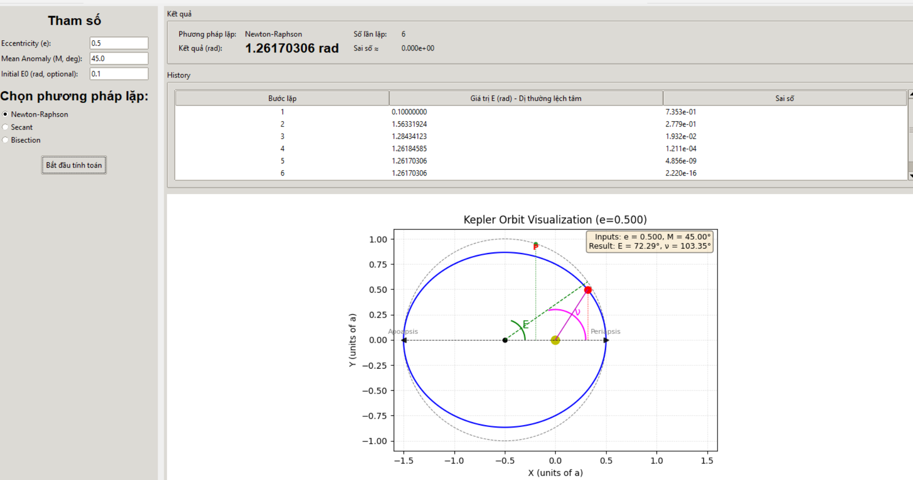

# Kepler Equation Solver

## Giới thiệu
Dự án này cung cấp công cụ giải phương trình Kepler để tính toán vị trí của một hành tinh trong quỹ đạo elip quanh một ngôi sao. Phương trình Kepler có dạng:

$$M = E - e \sin(E)$$

trong đó:
- $M$ là dị thường trung bình (Mean Anomaly)
- $E$ là góc dị thường (Eccentric Anomaly)
- $e$ là độ lệch tâm của quỹ đạo (Eccentricity)


Chương trình sử dụng nhiều phương pháp số để giải phương trình trên.

## Cài đặt

Yêu cầu Python 3.x và các thư viện sau:
```bash
pip install numpy matplotlib
```

## Sử dụng
Chạy chương trình bằng lệnh:
```bash
python main.py
```

Bạn có thể chỉnh sửa giá trị của $e$ và $M$ trong mã nguồn để kiểm tra kết quả cho các trường hợp khác nhau.

## Phương pháp
Dự án triển khai ba phương pháp chính để tìm nghiệm của phương trình Kepler:

### 1. Newton-Raphson
1. Chọn giá trị ban đầu $E_0$, thường là $M$.
2. Áp dụng công thức:

   $$E_{n+1} = E_n - \frac{f(E_n)}{f'(E_n)}$$

   với:
   - $f(E) = E - e \sin(E) - M$
   - $f'(E) = 1 - e \cos(E)$

3. Lặp lại cho đến khi độ sai số nhỏ hơn ngưỡng cho trước.

### 2. Secant
1. Chọn hai giá trị ban đầu $E_0$ và $E_1$.
2. Áp dụng công thức:

   $$E_{n+1} = E_n - f(E_n) \frac{E_n - E_{n-1}}{f(E_n) - f(E_{n-1})}$$

3. Lặp lại cho đến khi đạt độ chính xác mong muốn.

### 3. Binary (Phương pháp chia đôi)
1. Chọn khoảng $[E_{\min}, E_{\max}]$ sao cho $f(E_{\min})$ và $f(E_{\max})$ có dấu trái ngược.
2. Tính $E_{\text{mid}} = \frac{E_{\min} + E_{\max}}{2}$.
3. Nếu $f(E_{\text{mid}})$ gần 0 hoặc đạt độ chính xác mong muốn, dừng lại.
4. Nếu $f(E_{\text{mid}})$ cùng dấu với $f(E_{\min})$, thay $E_{\min}$ bằng $E_{\text{mid}}$, ngược lại thay $E_{\max}$.
5. Lặp lại cho đến khi đạt độ chính xác yêu cầu.

## Minh họa
Chương trình vẽ đồ thị biểu diễn quỹ đạo elip dựa trên các nghiệm tìm được của phương trình Kepler.




